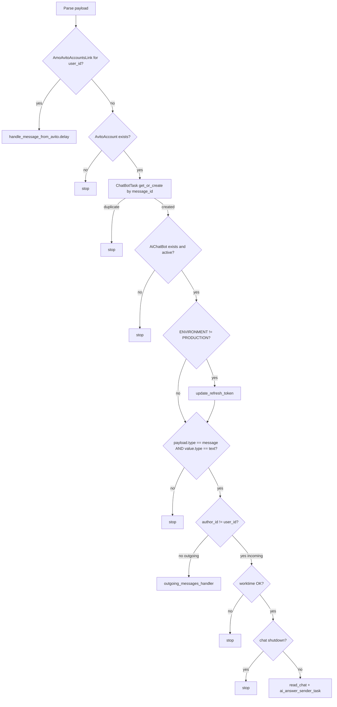
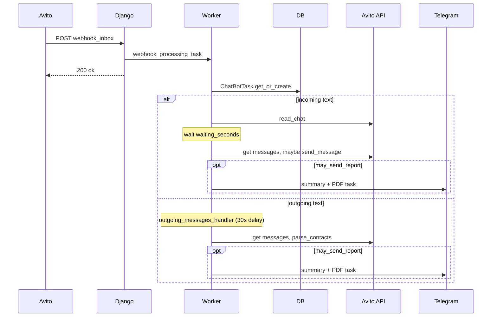

# Avito message flow

End-to-end path from an Avito Messenger webhook through Celery to either the **AMO A5 bridge** (`amo_a5client`) or the **AI chat bot** (`chat_bot`).

**Entry:** `POST /chat_bot/webhook_inbox` — `chat_bot.views.WebhookInboxViewClass`  
**Webhook URL:** `AVITO_WEBHOOK_URL` → `https://{AVITO_WEBHOOK_HOST}/chat_bot/webhook_inbox` (`base/settings.py`)  
**Requires:** Django (accept webhook) + Celery worker (do work).

---

## HTTP layer

```23:26:chat_bot/views.py
    def post(self, request, *args, **kwargs):
        request_data = json.loads(request.body.decode('utf-8'))
        WebhookInboxViewClass.webhook_processing_task.delay(request_data, trace_id=new_trace_id())
        return JsonResponse({"status": "ok"}, status=200)
```

The HTTP handler only enqueues `webhook_processing_task` and returns `200` with `{"status": "ok"}`.

---

## Decision tree (matches `webhook_processing_task` order)

The worker executes steps **in this order**. Any “stop” ends the task without later steps.



### Step 1 — Parse payload

From `request_data`:

| Field | Path |
|-------|------|
| `chat_id`, `message_id`, `text` | `payload.value` |
| `author_id`, `user_id` | `payload.value` (`user_id` = Avito account id in DB) |
| `created_at_timestamp` | `payload.value.created` |
| `message_type` | `payload.value.type` (text / image / voice / …) |
| `request_id` | top-level `id` |
| Request kind | `payload.type` (must be `message` on standard path) |

Parse errors are logged and the exception is re-raised.

---

## Branch A — AMO-linked account (`amo_a5client`)

**When:** `amo_a5client.get_amo_avito_accounts_link(user_id)` returns `AmoAvitoAccountsLink`.

**Important:** This runs **before** `AvitoAccount` / `AiChatBot` checks and **before** the text-only filter. Non-text Avito events (image, voice, …) still enter this branch.

1. `handle_message_from_avito.delay(...)` with `message_type` preserved.
2. Worker returns — **no** `ChatBotTask`, **no** `ai_answer_sender_task`.

### Inside `handle_message_from_avito`

| Step | Code behavior |
|------|----------------|
| Map attachment | `image` → `picture`, `voice` → `voice` for AMO-style attachment label |
| Link row | `MessageContactLink.get_or_create_by_avito_data(...)` |
| If `link.contact_id` set | `_launch_message_handling` → `amo_a5client.utils.message_handling.launch_new_message_handling` (countdown `0`) |
| Else, first attempt | Re-queue same task with `retry=True`, **countdown 10s** |
| Else after retry | Log `"Message not found"` and stop |

The AMO A5 pipeline (lead/chatbot pairing, Avito API, AI) lives in `amo_a5client/utils/message_handling.py` — not in `chat_bot.tasks`.

---

## Branch B — Standard AI chat bot

### Step 2 — Account and deduplication

| Step | Condition |
|------|-----------|
| Direction | `incoming_msg = (author_id != user_id)` — `True` = buyer message |
| Account | `AvitoAccount.objects.filter(id=user_id).first()` — stop if missing |
| Dedup | `ChatBotTask.objects.get_or_create(avito_account, chat_id, message_id, message_created_at, text)` — stop if `created=False` |

`ChatBotTask.message_id` is the **primary key** (string). The same Avito `message_id` is passed into `ai_answer_sender_task` as `new_task_id` and used as `ChatBotTask.objects.get(pk=...)`.

Default on create: `is_incoming=True`.

### Step 3 — Chat bot gates

| Step | Condition |
|------|-----------|
| Bot exists | `AiChatBot.objects.filter(account=avito_account).first()` |
| Active | `chatbot.is_active` |
| Token (non-prod only) | `ENVIRONMENT != "PRODUCTION"` → `avito_account.update_refresh_token()` |
| Event type | `payload.type == "message"` |
| Message type | `payload.value.type == "text"` — **image/voice/etc. stop here** on this branch |

### Step 4 — Outgoing (`incoming_msg == False`)

Seller/manager message — enqueue `outgoing_messages_handler` with `task_id=new_task.pk` (same as `message_id`).

**Scheduling (source code):**

```112:119:chat_bot/views.py
            outgoing_messages_handler.s(
                chat_id=chat_id,
                message_id=message_id,
                account_id=avito_account.pk,
                chatbot_id=chatbot.pk,
                task_id=new_task.pk,
                trace_id=tlogger.trace_id,
            ).apply_async(countdown=30)
```

Outgoing handler is delayed **30s** so the bot’s own reply can be classified before treating the message as manual manager input.

#### `outgoing_messages_handler` sequence

| Order | Check / action |
|-------|----------------|
| 1 | Set `new_task.is_incoming = False` |
| 2 | If outgoing text matches recent `answer_text` on incoming tasks → stop (“from AI”) |
| 3 | Else if text matches last `WorkedTrigger.message` → stop (“from trigger”) |
| 4 | Treat as manual manager message |
| 5 | If `shutdown_after_manager` → `chat_shutdown_by_user = True` on task |
| 6 | If `not chatbot.send_new_contact_report` → stop |
| 7 | If `summaries.new_contact_report_sent` (any task in chat with `summary_sanded=True`) → stop |
| 8 | Load last 50 messages; if last non-system message id ≠ `message_id` → stop (stale) |
| 9 | `parse_contacts` (no Avito reply sent) |
| 10 | `contacts_saving.task_contacts_save(..., is_incoming=False)` |
| 11 | If `summaries.may_send_report` → `summary_sending.send_summary` |
| 12 | If `not chatbot.read_only` → `dialog_triggers.initiate_trigger_condition_check` |

### Step 5 — Incoming (`incoming_msg == True`)

| Order | Check / action |
|-------|----------------|
| 1 | `avito_chatbots.check_chatbot_worktime_now` (Moscow TZ, `work_time_from` / `work_time_to`) |
| 2 | `avito_chatbots.check_chatbot_shutdown_for_chat` — any `ChatBotTask` in chat with `chat_shutdown_by_user=True` and `shutdown_after_manager` on bot |
| 3 | `avito_api.read_chat` |
| 4 | `ai_answer_sender_task.apply_async(countdown=chatbot.waiting_seconds)` |

---

## `ai_answer_sender_task` (incoming)

| Order | Action |
|-------|--------|
| 1 | Load chat: `messaging.api.get_chat_last_50_messages_by_chat_id` |
| 2 | `avito_messages.is_message_actual` — false if newer **incoming** message, or newer **outgoing** not in bot’s `answer_text` set |
| 3 | `companies_branches.define_company_branch` |
| 4a | **`read_only`:** `parse_contacts` only — no `send_message` |
| 4b | **Else:** `generate_answer_and_parse_contacts`, append `"..."` to answer, `avito_api.send_message` |
| 5 | `contacts_saving.task_contacts_save(..., is_incoming=True)` |
| 6 | If `summaries.may_send_report` → `summary_sending.send_summary` |
| 7 | If `not read_only` → `dialog_triggers.initiate_trigger_condition_check` |

### `may_send_report` (shared incoming/outgoing)

Requires `chatbot.send_new_contact_report` and at least one of `mobile`, `whatsapp`, `telegram` on parsed contacts (`chat_bot/utils/summaries.py`).

### `send_summary` / `summary_sender`

| Step | Behavior |
|------|----------|
| Guard | Lock chat tasks with `select_for_update`, check `summary_sanded` on locked rows, set flag on all tasks before Telegram send |
| Data | Last 50 messages + `get_chat_by_id`; `avito_chat_summary_ai_generator` |
| Telegram | HTML summary via `utils.tg.send_message` if text length > 20 |
| Target chat | `company_branch.telegram_id` if branch set on latest task with branch, else `avito_account.telegram_id` |
| PDF | `history_pdf.history_pdf_sender_task.delay` → PDF to same `telegram_id` |
| Flag | `summary_sanded=True` on **all** `ChatBotTask` rows for that `chat_id` before send |

---

## Dialog triggers (after AI or manual outgoing)

Only when `not chatbot.read_only`.

1. `initiate_trigger_condition_check` picks next `DialogTrigger` (first bot trigger or chain after last `WorkedTrigger`).
2. Schedules `dialog_trigger_launcher` with `countdown` = `delay_before_launch_trigger_sec` (bot or last trigger).
3. `dialog_trigger_launcher` re-reads chat, validates `last_message_id`, optional AI condition, sends `trigger.message` via `avito_api.send_message`, creates `WorkedTrigger`, may chain another check.

---

## Sequence diagram (standard chat-bot path)



---

## Models in this flow

| Model | Role |
|-------|------|
| `AvitoAccount` | OAuth credentials; `telegram_id` for reports |
| `AiChatBot` | Worktime, `waiting_seconds`, `read_only`, triggers, report flags |
| `ChatBotTask` | One row per `message_id` (PK); contacts, `summary_sanded`, shutdown |
| `CompanyBranch` | Optional per-chat Telegram target |
| `DialogTrigger` / `WorkedTrigger` | Follow-up messages |
| `AmoAvitoAccountsLink` | Routes webhook to `amo_a5client` |
| `MessageContactLink` | AMO↔Avito message pairing (bridge only) |

Voice/image on the **standard** branch are dropped at the text-only gate. They are **not** transcribed in this webhook path.

---

## Idempotency and tracing

- **Dedup:** `get_or_create` on `message_id` (PK).
- **Debouncing (incoming):** `chatbot.waiting_seconds` before `ai_answer_sender_task`.
- **Stale message (incoming task):** `is_message_actual` in `chat_bot/utils/avito_messages.py`.
- **Tracing:** `trace_id` from `new_trace_id()` at HTTP, passed through Celery (`TraceLogger`).

---

## Failure modes

| Symptom | Likely cause |
|---------|----------------|
| 200 but no processing | Celery worker down |
| Stops at account | `user_id` not in `AvitoAccount` |
| Stops after get_or_create | Duplicate webhook for same `message_id` |
| Stops at chatbot | No `AiChatBot` or inactive |
| Stops at type | Not `text` on standard branch |
| No AI reply | Outside worktime, chat shutdown, or `is_message_actual` false |
| AMO only | `AmoAvitoAccountsLink` — uses `amo_a5client`, not `AiChatBot` |
| Outgoing runs too early | `countdown=30` missing or too low on `apply_async` |

---

## Code index

| Role | File | Symbol |
|------|------|--------|
| HTTP + router task | `chat_bot/views.py` | `WebhookInboxViewClass`, `webhook_processing_task` |
| AMO bridge | `amo_a5client/amo_a5client.py` | `get_amo_avito_accounts_link`, `handle_message_from_avito` |
| AMO A5 pipeline task | `amo_a5client/utils/message_handling.py` | `launch_new_message_handling` |
| Incoming AI | `chat_bot/tasks.py` | `ai_answer_sender_task` |
| Outgoing | `chat_bot/tasks.py` | `outgoing_messages_handler` |
| Triggers | `chat_bot/tasks.py`, `chat_bot/utils/dialog_triggers.py` | `dialog_trigger_launcher`, `initiate_trigger_condition_check` |
| Worktime / shutdown | `chat_bot/utils/avito_chatbots.py` | `check_chatbot_worktime_now`, `check_chatbot_shutdown_for_chat` |
| Message freshness | `chat_bot/utils/avito_messages.py` | `is_message_actual` |
| Summaries | `chat_bot/utils/summary_sending.py`, `summaries.py` | `send_summary`, `may_send_report` |
| Chats API | `messaging/api.py` | `get_chat_last_50_messages_by_chat_id`, `get_chat_by_id` |
| Avito API | `chat_bot/utils/avito_api.py` | `send_message`, `read_chat` |

Manual URLs under `/chat_bot/` (`statistics_daily_report/`, `chat_summary_report/`) return stub `{"status": "ok"}` in views — they do not run the pipeline unless you uncomment the delayed calls in code.
